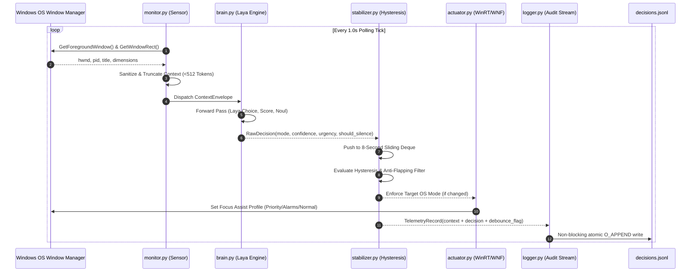

# Technical Requirements Document (TRD)

## Project: AuraFocus — Autonomous Context-Aware OS Focus Daemon
**Document Version:** 1.0.0  
**Status:** Approved / Architecture Milestone  
**Authors:** Staff Technical Product Manager (TPM) & Lead Systems Architect  
**Target Release:** v1.0.0  

---

## 1. System Architecture & Component Decomposition

AuraFocus is designed as a modular, unidirectional pipeline executing in a persistent desktop daemon. The system decouples **sensing**, **semantic inference**, **temporal stabilization**, **OS actuation**, and **audit logging** into isolated, single-responsibility components.

```
                           +------------------------+
                           |  Operating System OS   |
                           | (Active Window/Screen) |
                           +-----------+------------+
                                       |
                                       v
                           +------------------------+
                           |       monitor.py       |
                           | (Context & Fullscreen) |
                           +-----------+------------+
                                       |
                     Context Envelope (<512 Tokens)
                                       |
                                       v
                           +------------------------+
                           |        brain.py        |
                           | (Laya Decision Engine) |
                           +-----------+------------+
                                       |
                           Raw Decision Tuple (Mode, Conf, Score, Noul)
                                       |
                                       v
                           +------------------------+
                           |     stabilizer.py      |
                           |  (8-Sec Hysteresis)    |
                           +-----------+------------+
                                       |
                   Stabilized Decision & Debounce Flag
                                       |
                +----------------------+----------------------+
                |                                             |
                v                                             v
    +------------------------+                    +------------------------+
    |      actuator.py       |                    |       logger.py        |
    | (OS Focus Assist / DND)|                    |  (Async JSONL Audit)   |
    +-----------+------------+                    +-----------+------------+
                |                                             |
                v                                             v
         OS State Applied                               decisions.jsonl
                                                              |
                                                              v
                                                  +------------------------+
                                                  |       report.py        |
                                                  | (CLI Analytics Engine) |
                                                  +------------------------+
```

### 1.1 Component Responsibilities

| Component | Module | Responsibilities |
| :--- | :--- | :--- |
| **Configuration** | `config.py` | Centralized hyperparameter management: polling intervals, hysteresis thresholds, token budgets, log paths, process blacklist/whitelist. |
| **Sensory Layer** | `monitor.py` | Extracts foreground window handle, resolves process name, queries window title, detects fullscreen status via Win32 APIs (with POSIX stub). |
| **Inference Engine** | `brain.py` | Manages the Laya non-autoregressive decision model. Sanitizes and tokenizes state envelopes (<512 tokens), executing typed queries (`choice`, `score`, `noul`). |
| **Stabilization Engine** | `stabilizer.py` | Implements an 8-second temporal sliding window to suppress transient switching noise and prevent rapid OS DND toggling (anti-flapping). |
| **OS Actuator** | `actuator.py` | Interfaces with Windows Focus Assist / Quiet Hours subsystems via WinRT/WNF/Registry APIs, enforcing the stabilized focus state. |
| **Audit Engine** | `logger.py` | High-throughput, non-blocking asynchronous writer appending structured decision telemetry to `decisions.jsonl`. |
| **Audit Reporter** | `report.py` | Standalone CLI utility generating structured Markdown reports analyzing system accuracy, suppression counts, and state transition histories. |
| **User Interface** | `tray.py` | System tray daemon (`pystray`) providing real-time visual status, manual state overrides, and user-triggered report generation. |
| **Orchestrator** | `main.py` | Daemon lifecycle manager coordinating thread synchronization, loop timing, and clean shutdown traps (`SIGINT`, `SIGTERM`). |

---

## 2. Unidirectional Data-Flow Sequence



---

## 3. Laya Typed Decision Schema & Context Contract

Laya functions as a **System 1 non-autoregressive decision engine**. Rather than generating free-form textual tokens, Laya processes an input state envelope and solves caller-defined typed questions in a single bidirectional transformer forward pass ($\le 40\text{ ms}$).

### 3.1 Typed Primitives

AuraFocus queries three orthogonal decision primitives in a single pass:

```python
import laya

# Model instantiation
agent = laya.load("convaiinnovations/laya", subfolder="typed-decisions")

# 1. Categorical Intent Selection (Choice)
FOCUS_MODES = [
    "deep_work",              # IDEs, terminals, technical writing, scientific modeling
    "communication_meeting",  # Zoom, Teams, Slack, Outlook, Discord
    "casual_browsing",        # Social media, news, shopping, general web
    "media_or_gaming"         # Fullscreen video, gaming, streaming
]
mode_question = laya.Choice(FOCUS_MODES)

# 2. Cognitive Focus Depth / Urgency (Score)
# Evaluates focus depth on an ordinal scale of 1 to 10
urgency_question = laya.Score(levels=10)

# 3. Calibrated Notification Silence Decision (Noul)
# Calibrated boolean probability P(Silence = True) in [0.0, 1.0]
silence_question = laya.Noul()
```

### 3.2 State Envelope & Strict 512-Token Guarantee

The input to Laya is a structured representation of the desktop foreground context. To guarantee sub-40ms CPU inference and prevent memory degradation, the payload is constrained to a **hard budget of 512 tokens**.

#### Context Schema:
```json
{
  "process": "Code.exe",
  "title": "AuraFocus - brain.py [Workspace] - Visual Studio Code",
  "fullscreen": false,
  "system_time": "14:32",
  "monitor_count": 2
}
```

#### Token Budget Allocation:
| Context Field | Max Allowed Characters | Token Estimate | Truncation Policy |
| :--- | :--- | :--- | :--- |
| `process` | 64 chars | ~16 tokens | Truncate basename from right. |
| `title` | 384 chars | ~128 tokens | Center-truncate preserving prefix and suffix: `<prefix>...<suffix>`. |
| `metadata` | 128 chars | ~32 tokens | Deterministic key-value formatting. |
| Model Overhead | N/A | ~40 tokens | Special tokens (`[CLS]`, `[SEP]`, question prompts). |
| **Total Context** | **< 600 chars** | **$\le 250$ tokens** | **Strictly $< 512$ tokens** (2x safety margin). |

---

## 4. Hysteresis & Anti-Flapping Algorithm

### 4.1 The Flapping Problem
If a user is deep in code (`deep_work`, Focus Assist Enabled) and briefly switches to Slack (`communication_meeting`) for 3 seconds to check a teammate's link, a naive system will toggle Focus Assist OFF, flood the user with accumulated notification toasts, and then toggle Focus Assist back ON when the user returns to their IDE. This behavior is unacceptable.

### 4.2 Mathematical Formulation of the 8-Second Sliding Window

Let $t$ be the current evaluation discrete tick index, with polling interval $\Delta t = 1.0\text{ s}$.  
The sliding window $W(t)$ is an ordered FIFO queue of the last $N = 8$ evaluation tuples:

$$W(t) = \left\{ d_{t-7}, d_{t-6}, \dots, d_{t-1}, d_{t} \right\}$$

where each decision $d_i$ is defined as:
$$d_i = \left( m_i, c_i, s_i \right)$$
- $m_i \in \mathcal{M} = \{\text{deep\_work}, \text{communication\_meeting}, \text{casual\_browsing}, \text{media\_or\_gaming}\}$
- $c_i \in [0.0, 1.0]$ is Laya's mode confidence.
- $s_i \in \{0, 1\}$ is the boolean silence recommendation (`should_silence`).

Let $S_{\text{active}} \in \{\text{FOCUS\_ON}, \text{FOCUS\_OFF}\}$ be the current active OS focus state.

#### State Transition Logic:
1. **Candidate State Evaluation:** Let $m_{\text{candidate}} = m_t$ be the raw mode predicted at the current tick $t$.
2. **Persistence Threshold:** A transition from $S_{\text{active}}$ to the target state associated with $m_{\text{candidate}}$ requires that:
   $$\sum_{j=t-(K-1)}^{t} \mathbb{I}\left(m_j = m_{\text{candidate}} \land c_j \ge \theta_{\text{conf}}\right) \ge K$$
   where:
   - $K = 5$ consecutive ticks ($\ge 5\text{ seconds}$ sustained presence).
   - $\theta_{\text{conf}} = 0.65$ (minimum confidence threshold).
3. **Transient Suppression:** If the raw predicted mode differs from the active mode but has not met the persistence threshold $K$, the candidate mode is suppressed:
   $$\text{debounce\_action\_applied} = \text{True}$$
   The OS focus state remains unchanged.
4. **Fast-Path Fullscreen Override:**  
   If $d_t.\text{is\_fullscreen} = \text{True}$ AND $m_t \in \{\text{media\_or\_gaming}, \text{communication\_meeting}\}$ with $c_t \ge 0.85$:
   - Bypass the 5-second persistence requirement immediately ($K = 1$).
   - Instantly transition to `focus_assist_alarms_only` to prevent meeting or presentation popups.

---

## 5. OS Actuation Subsystem

### 5.1 Windows Focus Assist / Quiet Hours Matrix

AuraFocus maps stabilized decision intents directly to Windows Focus Assist profiles:

| Stabilized Laya Mode | Fullscreen State | Target Windows Focus Assist Profile | Win32 / WNF State Value |
| :--- | :--- | :--- | :--- |
| `deep_work` | False | **Priority Only** | `WNF_QUIETHOURS_PRIORITY` (1) |
| `deep_work` | True | **Alarms Only** | `WNF_QUIETHOURS_ALARMS` (2) |
| `media_or_gaming` | True / False | **Alarms Only** | `WNF_QUIETHOURS_ALARMS` (2) |
| `communication_meeting` | True (Presenting) | **Alarms Only** | `WNF_QUIETHOURS_ALARMS` (2) |
| `communication_meeting` | False (Chat/Email) | **Normal (Off)** | `WNF_QUIETHOURS_OFF` (0) |
| `casual_browsing` | Any | **Normal (Off)** | `WNF_QUIETHOURS_OFF` (0) |

### 5.2 Actuation Implementation Mechanics
1. **Primary Driver:** Windows Notification Facility (WNF) via `NtUpdateWnfStateData` targeting `WNF_SHEL_QUIETHOURS_ACTIVE_PROFILE_CHANGED`.
2. **Secondary Driver:** WinRT `Windows.UI.Notifications.Management.UserNotificationListener` interface.
3. **Tertiary Fallback:** Registry policy key manipulation at `HKCU\Software\Microsoft\Windows\CurrentVersion\Notifications\Settings`.
4. **POSIX Driver:** Headless mock / DBus notification server interface (`org.freedesktop.Notifications`) for seamless Linux CI/CD and developer testing.

---

## 6. Real-Time Audit Engine Specification

### 6.1 `decisions.jsonl` Record Format
Every line is an atomic, self-contained JSON document terminated by `\n`:

```json
{
  "timestamp": "2026-09-23T15:58:30.123456Z",
  "process_name": "Code.exe",
  "window_title": "AuraFocus - docs/TRD.md - Visual Studio Code",
  "is_fullscreen": false,
  "laya_mode": "deep_work",
  "confidence": 0.942,
  "urgency_score": 8,
  "should_silence": true,
  "debounce_action_applied": false,
  "os_dnd_state": "focus_assist_priority"
}
```

### 6.2 Asynchronous Lockless Logging Pipeline
- Inference threads push `TelemetryRecord` objects onto an in-memory thread-safe `queue.Queue(maxsize=1000)`.
- A dedicated background I/O worker thread consumes records and performs buffered writes to `decisions.jsonl`.
- Ensures zero disk I/O latency blocking the $\le 40\text{ ms}$ evaluation loop.
- Implements atomic batch flushing on daemon shutdown or `SIGINT`.
